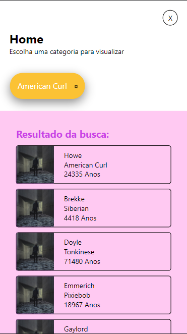

# dogapp
App para adoção de animais

App desenvolvido como teste de estágio para a empresa PalmSoft.

O aplicativo possue 3 telas, sendo elas;

Welcome;

SignIn;

e Home:

OBS: As informações de cada card na tela "Home" foram recebidas através de um endpoint para testes, não necessariamente serão informações/imagens reais, acredito que apesar da imagem não estar correta, já é o suficiente, pois se trata de um teste e é um erro do qual não tenho controle.

